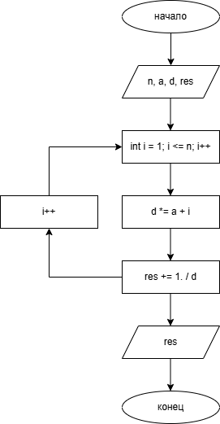

# Домашнее задание к работе 8 
## Условие задачи 

## 1. Алгоритм и блок-схема 
### Алгоритм 
1. Начало
2. Инициализировать переменные int `n` и double `a`
3. Инициализировать переменные double `d` = `a` и double `res` = 1. / `a`
4. Инициализировать цикл int `i` = 1; `i` <= `n`; `i`++
5. Тело цикла
   + `d` *= `a` + `i`
   + `res` += 1. / `d`
6. Вывод результата
7. Конец
### Блок-схема
  
[Ссылка на draw.io](https://viewer.diagrams.net/?tags=%7B%7D&lightbox=1&highlight=0000ff&edit=_blank&layers=1&nav=1&title=lab8newscheme.drawio.png&dark=auto#R%3Cmxfile%3E%3Cdiagram%20name%3D%22%D0%A1%D1%82%D1%80%D0%B0%D0%BD%D0%B8%D1%86%D0%B0-1%22%20id%3D%22m8s30ZJR6d9a7UZpJ98p%22%3E7Vpbb5swFP41vExaxSUQ8thc2mrSpGjR1u1p8sAFS4CR4zTJfv0MNlfnVhLTVUJKwOfYPjbfd86xTaJZs3j3SEAafsU%2BjDRT93eaNddM0zBdg90yzZ5rHNvlioAgXzSqFCv0FwqlLrQb5MN1oyHFOKIobSo9nCTQow0dIARvm81ecNQcNQUBlBQrD0Sy9hn5NBRaw5lUFU8QBWExtGOPeE0MitbiUdYh8PG2prIWmjUjGFNeinczGGXoFcDwfg9HasuZEZjQSzroyffFk249LyczZHz5kU6%2B%2FSafi8kJ%2FMCf4sF12bwYcU33RaOA4E3Kta8g2gitUEBC4a7WU8zqEeIYUrJnTcIacHYx4raC2RwLnTBjjYQsnKkQgSA5KE1XMLCCQOINqBzC9hR6NUiYdeabTJhuQ0ThKgVeVrNl4cF0IY3ZROYGK8qwzXVtOs%2BvusaauOOizK7T%2FLroBO1IRtYwm8gatioozXeD8l5AVsFq57A6ykEs3NNVBarF7UJfSl4dUE78%2ByxRMsmLwHqNvCa4LMQTH2az0Q9CfT6yxZgERoCi1%2BaMa3CeckExwhIj9ngl4OUqcSQfrPGGeFB0qmfGM3bavFFAAkglOzl15UN3Z3PUnTy2pqRZkfUFUQQjHBAQM5pSSBCbFiTtumVVcS6qXtAOFivywShLNHOWocRvPr8Rtlr3FF%2FKwsv%2BoIT0iP1IVwW%2BM%2BS2PCfpkzu7CXnn9Cab6jnDjQdODxNRhtn1nBpOv5y63SlsUvTWzR3HAbFvLuu8EVeYDoiz%2FhHNlHl1UlZP808%2F%2BVFi42b5cTLE0uEAMNtLUvdYknaSimOp2H%2F2H0xs16Z%2F4oEC8gASsdJPlCg8wV8RFdchmm%2FCciB5drrLpQe%2BQ%2B4HVqu9qtwOVnPIPkdSRntL1T37SPSpzj7D64RjTLRX8Su23O3VSTWpIzWkJjiBH4ZRKTF2PUI5Z%2ByoJnM4FF9EQ0c6%2B37hZ4y7s3fl2UnRKUj9fs4d0pnktjdyf6Nv93%2B%2FIywzT%2FY%2F68KvTGBrtRDnu3rlfN9wA47Lifm5%2F7O7SDRf6i5G6%2BcRw7qVvzCx%2Bv2bN6%2F%2BRmAt%2FgE%3D%3C%2Fdiagram%3E%3C%2Fmxfile%3E)
## 2. Реализация программы
```C
#define _CRT_SECURE_NO_DEPRECATE
#include <stdio.h>
#include <locale.h>
#include <math.h>

int main()
{
	system("chcp 1251");

    int n;
    double a;
    puts("Введите число a:");
    scanf("%lf", &a);
    puts("Введите число n:");
    scanf("%d", &n);

    double d = a;
    double res = 1. / a;

    for (int i = 1; i <= n; i++)
    {
        d *= a + i;
        res += 1. / d;
    }

    printf("Результат равен %lf", res);

	return 0;
}
```
## 3. Результат работы программы
Введите число a:  
5  
Введите число n:  
6  
Результат равен 0.238764
## 4. Информация о разработчике
Вильальба Агния, группа бТИИ-251
