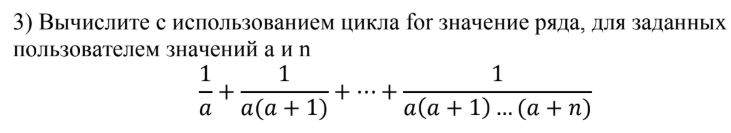
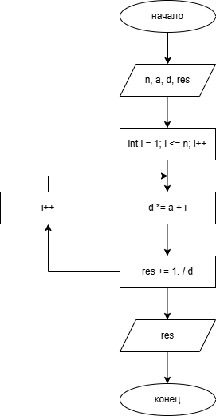

# Домашнее задание к работе 8 
## Условие задачи 

## 1. Алгоритм и блок-схема 
### Алгоритм 
1. Начало
2. Инициализировать переменные int `n` и double `a`
3. Инициализировать переменные double `d` = `a` и double `res` = 1. / `a`
4. Инициализировать цикл int `i` = 1; `i` <= `n`; `i`++
5. Тело цикла
   + `d` *= `a` + `i`
   + `res` += 1. / `d`
6. Вывод результата
7. Конец
### Блок-схема
  
[Ссылка на draw.io](https://viewer.diagrams.net/?tags=%7B%7D&lightbox=1&highlight=0000ff&edit=_blank&layers=1&nav=1&title=lab8new.drawio.png&dark=auto#R%3Cmxfile%3E%3Cdiagram%20name%3D%22%D0%A1%D1%82%D1%80%D0%B0%D0%BD%D0%B8%D1%86%D0%B0-1%22%20id%3D%22m8s30ZJR6d9a7UZpJ98p%22%3E7Vlbb5swGP01vExaxT3ksbm01aRJ0aqtj5MHLlgCjIzTJPv1M9hcnTQpiZkqISVgH185x9%2Fnz6BZy2T%2FSEAWfccBjDVTD%2FaatdJM0zA9g90K5MAR1%2FE4EBIUiEoN8Iz%2BQgHqAt2iAOadihTjmKKsC%2Fo4TaFPOxggBO%2B61V5x3B01AyGUgGcfxDL6ggIaCdRw503BE0RhVA3tOjYvSUBVWzxKHoEA71qQtdasJcGY8lSyX8K4YK8ihrd7OFFaz4zAlF7SQE9%2Frp9062UzXyLj269s%2FuM3%2BVpNTvAH%2FlQPrsvdixFzeqgqhQRvM46%2BgXgrUAFAQuG%2B1VLM6hHiBFJyYFWiFnFONeKuodmcCUx0Y9kiLxZTlQVC5LDuuqGBJQQTH2DlGLfvsdeihPXO1ibLLHYRovA5A35RsmPmwbCIJmwiK4MlZdpWurZYlVddY1W8WZVm10V5XQ%2Bi1paZNcwus4ajikrzv1F5LyhraHVKWl3lJFbL01NFqsX7hYHkvAawnAb3haNkOT8GeY78LrnMxNMAFrPRj1J93rLFmATGgKK37oxbdL63BMUIG4zY49WE17vECX%2BQ4y3xoWjU9oxn%2BunrRgEJIZX6KaWrH3q4mvZw8diekhVJ1hbEMYxxSEDCZMogQWxakPTLNk3BOat6RXtY7chHrSzVzGXBEr8F%2FEbYbj2SfSkzL%2BeTCjIi97auinx38m2lT9Lnd06X8sHuTe5qZA83mzQ9LkRtZtdrarjjauoNl7Ar0UeDO84DYv8yr%2FNKHDBdkBTtY1qAZXFaFy%2FK3zj%2BUVLjZv5xPtnScQMw%2B1vScFuSIknFtlTFn%2BMbE4va9C%2FcUEBpQMJWxrEShSf4K6ziOkbLIKwkknunuzL3wCPkcWi1%2BrvK7Wg1J%2B9zwmX0Q6rh3keST7X3mV4nnFKiv4tfEXL3dyfVotpqRE1xCj%2BNopJjHHqEcs%2F0o1rM6VB8kQwD5Rz7hZ8xG67elWcnRacg9fGcN7kzadneavmPHW9MR9iLZBj6%2BeJ2erJs832aV28%2B81vrfw%3D%3D%3C%2Fdiagram%3E%3C%2Fmxfile%3E)
## 2. Реализация программы
```C
#define _CRT_SECURE_NO_DEPRECATE
#include <stdio.h>
#include <locale.h>
#include <math.h>

int main()
{
	system("chcp 1251");

    int n;
    double a;
    puts("Введите число a:");
    scanf("%lf", &a);
    puts("Введите число n:");
    scanf("%d", &n);

    double d = a;
    double res = 1. / a;

    for (int i = 1; i <= n; i++)
    {
        d *= a + i;
        res += 1. / d;
    }

    printf("Результат равен %lf", res);

	return 0;
}
```
## 3. Результат работы программы
Введите число a:  
5  
Введите число n:  
6  
Результат равен 0.238764
## 4. Информация о разработчике
Вильальба Агния, группа бТИИ-251
